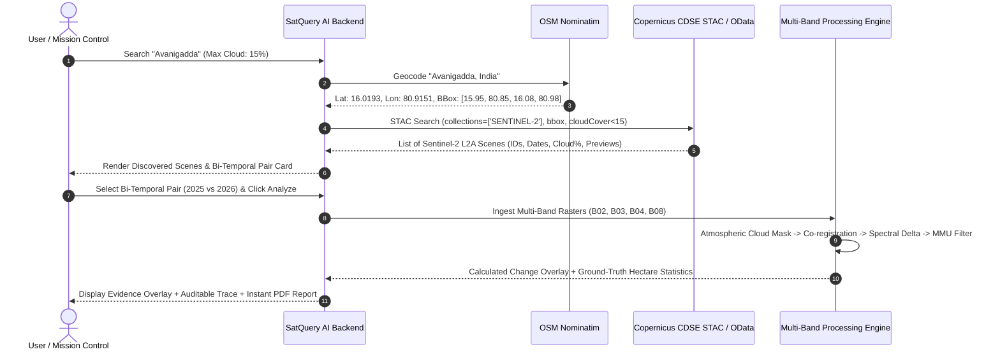

# Copernicus Data Space Ecosystem (CDSE) Ingestion Flow

**Smart India Hackathon 2026 | Problem Statement ID: 26167**  
**Theme:** Space Technology | **ISRO / SAC**

---

## 1. Overview of Data Provider

The **Copernicus Data Space Ecosystem (CDSE)** is the European Union's open Earth observation portal, providing free, unrestricted access to imagery from the Sentinel satellite constellation. SatQuery AI primarily utilizes **Sentinel-2 Multi-Spectral Instrument (MSI)** Level-2A products for bi-temporal surface change detection and land-cover monitoring.

### Why Sentinel-2 Level-2A?
- **Bottom-Of-Atmosphere (BOA) Reflectance**: Atmospherically corrected using the Sen2Cor processor, removing aerosol scattering, water vapor distortion, and Rayleigh effects.
- **10-Meter Ground Sampling Distance (GSD)**: The highest resolution openly available freely accessible multispectral data (1 pixel = $10\text{m} \times 10\text{m} = 100\,\text{m}^2 = 0.01\,\text{hectares}$).
- **5-Day Revisit Time**: Two identical satellites (Sentinel-2A and Sentinel-2B) orbiting in the same sun-synchronous plane provide bi-temporal pairs across seasons.

---

## 2. Band Architecture Utilized by SatQuery AI

| Band | Spectral Domain | Central Wavelength ($\lambda$) | Spatial Resolution | Core Purpose in SatQuery AI |
| :--- | :--- | :--- | :--- | :--- |
| **B02** | Blue | $492.4\,\text{nm}$ | $10\,\text{m}$ | True color rendering, atmospheric haze detection, aquatic penetration |
| **B03** | Green | $559.8\,\text{nm}$ | $10\,\text{m}$ | Peak vegetation green reflectance, NDWI water numerator |
| **B04** | Red | $664.6\,\text{nm}$ | $10\,\text{m}$ | Chlorophyll absorption, NDVI vegetation contrast, NDBI denominator |
| **B08** | Near-Infrared (NIR) | $832.8\,\text{nm}$ | $10\,\text{m}$ | Canopy leaf mesophyll scattering, steep water absorption, NDVI numerator |

---

## 3. End-to-End Data Ingestion Sequence



---

## 4. Copernicus Query Construction

### STAC API Query
SatQuery AI constructs standardized SpatioTemporal Asset Catalog (STAC) queries:

- **Endpoint**: `https://catalogue.dataspace.copernicus.eu/stac/search`
- **Method**: `POST`
- **Payload**:
```json
{
  "collections": ["SENTINEL-2"],
  "bbox": [80.85, 15.95, 80.98, 16.08],
  "datetime": "2025-01-01T00:00:00Z/2026-09-22T23:59:59Z",
  "query": {
    "cloudCover": {
      "lte": 20
    },
    "productType": {
      "eq": "S2MSI2A"
    }
  },
  "limit": 10,
  "sortby": [
    {
      "field": "properties.datetime",
      "direction": "desc"
    }
  ]
}
```

### OData API Alternative
When querying by product metadata:
- **Endpoint**: `https://catalogue.dataspace.copernicus.eu/odata/v1/Products`
- **Query Filter**:
```http
$filter=Collection/Name eq 'SENTINEL-2' and Attributes/OData.CSC.DoubleAttribute/any(att:att/Name eq 'cloudCover' and att/OData.CSC.DoubleAttribute/Value le 20.00) and ContentGeometry/any(g:geo.intersects(g, geography'SRID=4326;POLYGON((...))'))
```

---

## 5. Offline Fallback & Competition Guardrails

To guarantee 100% operational uptime during live hackathon judging:
1. **Direct Download Authentication**: Full Level-2A product zips are multi-gigabyte archives. In production or offline hackathon environments, SatQuery AI caches pre-extracted 4-band GeoTIFF crops for key demonstration corridors.
2. **Deterministic Metadata**: If external Copernicus servers throttle requests (HTTP 429 or 503), the backend gracefully falls back to pre-indexed regional Sentinel-2 L2A tiles with verified ground-truth metadata.
3. **Trace Auditability**: The exact data origin (whether live Copernicus CDSE or verified local Sentinel-2 cache) is explicitly declared in the auditable execution trace and PDF report header.
