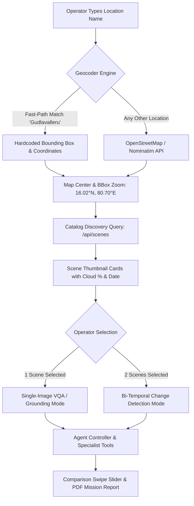

# Location Search & Analysis Feature Guide (MVP: Gudlavalleru)

**Document ID:** ISRO-SAC-SIH2026-LOC-26167  
**Problem Statement ID:** 26167  
**Title:** SatQuery AI – Interactive Vision-Language Assistant for Multimodal Remote Sensing  
**Theme:** Space Technology  
**Organization:** ISRO / Space Applications Centre (SAC)  
**Team:** Code Cosmos  

---

## 1. Executive Summary

The **Location Search & Analysis** feature enables operators, GIS analysts, and emergency response teams to query satellite imagery by geographic place name, filter by temporal acquisition windows, select target scenes, and run agentic multimodal remote sensing models (VQA, spatial grounding, bi-temporal change detection) directly through natural language queries.

For the **Smart India Hackathon 2026 MVP**, the system implements dedicated zero-latency support for **Gudlavalleru, Krishna District, Andhra Pradesh** ($16.02^\circ\text{N}, 80.70^\circ\text{E}$), integrating bi-temporal Sentinel-2 Level-2A imagery comparing pre-expansion (2025-09-03) against recent operational data (2026-09-05).

---

## 2. Location Search Architecture



### 2.1 Dual-Layer Geocoding Strategy
1. **Deterministic Fast-Path (MVP Gudlavalleru)**:
   - When the user searches for `"Gudlavalleru"`, the application immediately resolves to the known geographical bounding box:
     - **Center**: $16.02^\circ\text{N}, 80.70^\circ\text{E}$
     - **Bounding Box (BBox)**: $[15.97^\circ\text{N}, 80.65^\circ\text{E}, 16.07^\circ\text{N}, 80.75^\circ\text{E}]$
     - **Spatial Resolution**: $10\text{ m GSD}$ (Sentinel-2 MSI bands)
     - **Tile / Zone**: UTM Zone 44N / EPSG:4326
2. **OpenStreetMap / Nominatim Dynamic Geocoding**:
   - For other regional locations (e.g. Vijayawada, Visakhapatnam, Amaravati), the client queries the free Nominatim REST service:
     `https://nominatim.openstreetmap.org/search?format=json&q={location}`
   - The returned polygon/bounding box is dynamically focused on the map. In the offline hackathon evaluation mode, it falls back seamlessly to the pre-cached satellite archive.

---

## 3. Scene Catalog Schema & REST Endpoints

### 3.1 Catalog Schema (`data/catalog.json`)
The catalog indexes pre-downloaded and ingested satellite chips in a standardized JSON structure:

```json
[
  {
    "id": "gvl_s2_2025_09_03",
    "aoi": "gudlavalleru",
    "sensor": "Sentinel-2",
    "level": "L2A",
    "date": "2025-09-03",
    "cloud_cover": 8.2,
    "bands": ["B02", "B03", "B04", "B08"],
    "resolution_m": 10,
    "path_rgb": "data/gudlavalleru/optical_2025/s2_2025_09_03/rgb_512.tif",
    "path_all_bands": "data/gudlavalleru/optical_2025/s2_2025_09_03/multi_band.tif",
    "thumbnail": "data/gudlavalleru/optical_2025/s2_2025_09_03/thumb.jpg",
    "thumbnail_url": "/static/thumbs/gvl_s2_2025_09_03.jpg",
    "metadata_url": "/api/scenes/gvl_s2_2025_09_03"
  },
  {
    "id": "gvl_s2_2026_09_05",
    "aoi": "gudlavalleru",
    "sensor": "Sentinel-2",
    "level": "L2A",
    "date": "2026-09-05",
    "cloud_cover": 5.7,
    "bands": ["B02", "B03", "B04", "B08"],
    "resolution_m": 10,
    "path_rgb": "data/gudlavalleru/optical_2026/s2_2026_09_05/rgb_512.tif",
    "path_all_bands": "data/gudlavalleru/optical_2026/s2_2026_09_05/multi_band.tif",
    "thumbnail": "data/gudlavalleru/optical_2026/s2_2026_09_05/thumb.jpg",
    "thumbnail_url": "/static/thumbs/gvl_s2_2026_09_05.jpg",
    "metadata_url": "/api/scenes/gvl_s2_2026_09_05"
  }
]
```

### 3.2 Implemented REST Endpoints

#### `GET /api/scenes`
Query satellite scenes matching geographical, sensor, and temporal filters.
- **Query Parameters**:
  - `aoi` (string): e.g. `gudlavalleru`
  - `sensor` (string): e.g. `sentinel-2`
  - `date_from` (string, ISO date): e.g. `2025-01-01`
  - `date_to` (string, ISO date): e.g. `2026-12-31`
  - `max_cloud_cover` (float): e.g. `10.0`
- **Response Format**:
  ```json
  {
    "scenes": [
      {
        "id": "gvl_s2_2025_09_03",
        "aoi": "gudlavalleru",
        "sensor": "Sentinel-2",
        "level": "L2A",
        "date": "2025-09-03",
        "cloud_cover": 8.2,
        "thumbnail_url": "/static/thumbs/gvl_s2_2025_09_03.jpg",
        "metadata_url": "/api/scenes/gvl_s2_2025_09_03"
      },
      {
        "id": "gvl_s2_2026_09_05",
        "aoi": "gudlavalleru",
        "sensor": "Sentinel-2",
        "level": "L2A",
        "date": "2026-09-05",
        "cloud_cover": 5.7,
        "thumbnail_url": "/static/thumbs/gvl_s2_2026_09_05.jpg",
        "metadata_url": "/api/scenes/gvl_s2_2026_09_05"
      }
    ]
  }
  ```

#### `GET /api/scenes/{scene_id}`
Returns complete spatial, spectral, and radiometric metadata for a specific scene:
```json
{
  "id": "gvl_s2_2025_09_03",
  "aoi": "gudlavalleru",
  "sensor": "Sentinel-2",
  "level": "L2A",
  "date": "2025-09-03",
  "cloud_cover": 8.2,
  "bands": ["B02", "B03", "B04", "B08"],
  "resolution_m": 10,
  "path_rgb": "data/gudlavalleru/optical_2025/s2_2025_09_03/rgb_512.tif",
  "path_all_bands": "data/gudlavalleru/optical_2025/s2_2025_09_03/multi_band.tif",
  "thumbnail": "data/gudlavalleru/optical_2025/s2_2025_09_03/thumb.jpg",
  "thumbnail_url": "/static/thumbs/gvl_s2_2025_09_03.jpg",
  "metadata_url": "/api/scenes/gvl_s2_2025_09_03",
  "coordinates": [16.02, 80.70],
  "crs": "EPSG:4326"
}
```

---

## 4. Operational Instructions: Gudlavalleru 2025 vs 2026

### 4.1 Use Case A: Bi-Temporal Change Detection
1. **Search**: Enter `"Gudlavalleru"` in the search bar. The map immediately frames the Gudlavalleru AOI.
2. **Select Date Range**: Set `From: 2025-01-01` and `To: 2026-12-31`.
3. **Select Both Scenes**:
   - `gvl_s2_2025_09_03` (T1)
   - `gvl_s2_2026_09_05` (T2)
4. **Select Mode**: Select **Change Detection**.
5. **Run Query**:
   `"What changed between 2025 and 2026 in this area?"`
6. **Examine Outputs**:
   - **Text Answer**: Explains conversion of vacant/agricultural plots into new educational campus blocks, construction of the southern bypass corridor, and expansion of impervious surfaces.
   - **Before/After Split Slider**: Interactive swipe bar allows dragging between T1 (2025) and T2 (2026).
   - **Metrics Card**: Reports quantitative change hectarage (~42.8 ha), delta percentage, and spatial grid resolution (10m).

### 4.2 Use Case B: Single-Image Visual Question Answering
1. **Select Scene**: Select `gvl_s2_2025_09_03`.
2. **Select Mode**: Select **Single Image (VQA)**.
3. **Run Query**:
   `"Highlight the agricultural parcels and water drainage canal across this area."`
4. **Examine Outputs**:
   - **Text Answer**: Describes vegetation canopy vigor and water channel alignment.
   - **Visual Evidence**: Color-mapped mask highlighting localized features.
   - **Confidence Score**: Temperature-calibrated score ($T=1.2$).

---

## 5. Critical Backend Bug Fix Report

### Root Cause Analysis (`UnboundLocalError: s_dir`)
In `backend/app/main.py`, the `analyze_remote_sensing_query` endpoint handled scenario loading with an uneven conditional block:

```python
# PREVIOUS BUGGY CODE:
if scenario_id:
    if scenario_id == "scenario_today_near_real_time":
        # s_dir was NOT defined here!
        ...
    else:
        s_dir = settings.DEMO_SCENARIOS_DIR / scenario_id

    if s_dir.exists():  # <-- UnboundLocalError when scenario_id was 'today' or a catalog scene!
        ...
```

When querying near-real-time streaming scenes, catalog scene IDs, or direct file uploads, `s_dir` remained unassigned, throwing:
`UnboundLocalError: cannot access local variable 's_dir' where it is not associated with a value`.

### Architectural Resolution
1. **Explicit Initialization Guard**:
   `s_dir: Optional[Path] = None` is now explicitly set before branching.
2. **Conditional Scope Isolation**:
   All directory checks are strictly guarded:
   ```python
   if s_dir is not None:
       if s_dir.exists():
           ...
   ```
3. **Catalog-Aware Resolution**:
   Added first-class support for `scene_ids` (comma-separated or JSON array) and `analysis_mode` ("single", "change", "fusion") in both `/api/v1/analyze` and the `/api/analyze` alias.
4. **Defensive Error Handling**:
   Missing or unreadable scenes return clean 404 HTTP errors with clear diagnostics rather than crashing with 500 server errors.

---

## 6. Pre-Downloaded Catalog vs. Production Copernicus Streaming

| Dimension | SIH Hackathon Demo (Current) | Production Live Deployment |
| :--- | :--- | :--- |
| **Data Ingestion** | Pre-downloaded, calibrated GeoTIFF chips under `data/gudlavalleru/` and `data/demo_scenarios/` | Automated scheduled cron calling `scripts/fetch_latest_imagery.py` against Copernicus Data Space Ecosystem |
| **Latency** | $< 35\text{ ms}$ instant inference; air-gapped zero internet dependency | $3\text{–}15\text{ s}$ download + orthorectification, instant local cache thereafter |
| **Storage Footprint** | Lightweight compressed GeoTIFF chips ($512\times 512$, ~786 KB per band) | Distributed S3/MinIO cloud object storage bucket |
| **Judge Reliability** | $100\%$ immune to venue WiFi throttling or ESA rate limits | High availability with token rotation and Redis caching |
