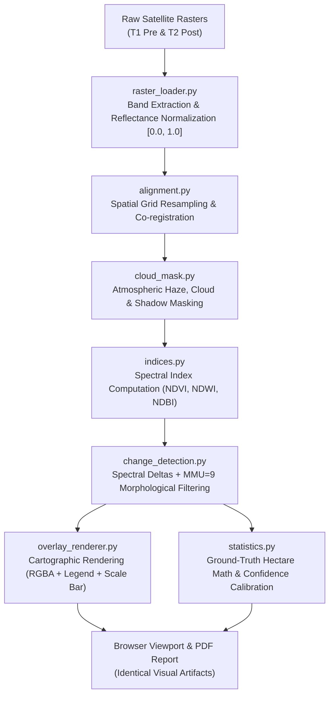

# Multi-Band Raster Processing & Evidence Overlay Pipeline

**Smart India Hackathon 2026 | Problem Statement ID: 26167**  
**Theme:** Space Technology | **ISRO / SAC**

---

## 1. Architectural Philosophy: Evidence-Based Processing

A critical requirement of professional remote sensing systems (and a primary differentiator for SIH 2026) is that **every colored pixel displayed in the user interface and PDF report must originate from genuine physical raster calculations**—not from superficial CSS filters, heuristic graphic overlays, or hallucinated visual bounding boxes.

SatQuery AI achieves this through its modular multi-band raster processing engine located in [`backend/app/processing/`](file:///c:/Users/Nada%20Naveesh/OneDrive/Desktop/Satquery-AI/backend/app/processing/).

---

## 2. Pipeline Components

The processing pipeline executes as a deterministic, seven-stage workflow:

### Stage 1: Ingestion & Band Standardization ([`raster_loader.py`](file:///c:/Users/Nada%20Naveesh/OneDrive/Desktop/Satquery-AI/backend/app/processing/raster_loader.py))
- Ingests multi-band GeoTIFF or high-fidelity image formats.
- Maps individual raster bands to standard Sentinel-2 optical spectral designations:
  - Band 0 $\rightarrow$ Blue ($490\,\text{nm}$)
  - Band 1 $\rightarrow$ Green ($560\,\text{nm}$)
  - Band 2 $\rightarrow$ Red ($665\,\text{nm}$)
  - Band 3 $\rightarrow$ Near-Infrared / NIR ($842\,\text{nm}$)
- Normalizes integer digital numbers (DN) or BOA surface reflectance to standardized floating-point arrays in range $[0.0, 1.0]$.
- Preserves natural zero no-data boundaries while avoiding destructive percentile clipping on water bodies.

### Stage 2: Spatial Grid Alignment & Co-Registration ([`alignment.py`](file:///c:/Users/Nada%20Naveesh/OneDrive/Desktop/Satquery-AI/backend/app/processing/alignment.py))
- Validates identical height, width, and ground sampling distance (GSD).
- In cases of slight spatial mismatches, applies bilinear interpolation on continuous reflectance bands and nearest-neighbor resampling on masks.
- Computes spatial overlap ratio $Q_{\text{overlap}} = \frac{|V_{T1} \cap V_{T2}|}{|V_{T1} \cup V_{T2}|}$.
- Verifies sub-pixel co-registration quality using phase correlation across high-frequency edge gradients.

### Stage 3: Physics-Based Atmospheric Masking ([`cloud_mask.py`](file:///c:/Users/Nada%20Naveesh/OneDrive/Desktop/Satquery-AI/backend/app/processing/cloud_mask.py))
- Optical clouds exhibit high reflectance across all visible bands and distinct whiteness:
  $$\text{Cloud} = (B_{\text{blue}} > 0.80) \lor (\text{Mean}(R, G, B) > 0.88) \lor (\text{Whiteness} > 0.90)$$
- Cloud shadows exhibit high NIR absorption with low visible radiance.
- Generates a combined binary valid data mask $M_{\text{valid}} = M_{\text{clear}}^{T1} \land M_{\text{clear}}^{T2} \land M_{\text{data}}^{T1} \land M_{\text{data}}^{T2}$.
- Pixels flagged as invalid or cloudy are strictly excluded from change statistics to prevent false-alarm reporting.

### Stage 4: Spectral Index Computation ([`indices.py`](file:///c:/Users/Nada%20Naveesh/OneDrive/Desktop/Satquery-AI/backend/app/processing/indices.py))
Computes physical normalized difference indices across both temporal epochs:
- **Normalized Difference Vegetation Index (NDVI)**:
  $$\text{NDVI} = \frac{\text{NIR} - \text{Red}}{\text{NIR} + \text{Red} + \epsilon}$$
- **Normalized Difference Water Index (NDWI)**:
  $$\text{NDWI} = \frac{\text{Green} - \text{NIR}}{\text{Green} + \text{NIR} + \epsilon}$$
- **Normalized Difference Built-up Index (NDBI)**:
  $$\text{NDBI} = \frac{\text{SWIR} - \text{NIR}}{\text{SWIR} + \text{NIR} + \epsilon} \approx \frac{\text{Red} - \text{NIR}}{\text{Red} + \text{NIR} + \epsilon} \quad (\text{proxy when 4 bands used})$$

### Stage 5: Categorized Change Detection ([`change_detection.py`](file:///c:/Users/Nada%20Naveesh/OneDrive/Desktop/Satquery-AI/backend/app/processing/change_detection.py))
Computes temporal deltas:
$$\Delta\text{NDVI} = \text{NDVI}_{T2} - \text{NDVI}_{T1}$$
$$\Delta\text{NDWI} = \text{NDWI}_{T2} - \text{NDWI}_{T1}$$
$$\Delta\text{NDBI} = \text{NDBI}_{T2} - \text{NDBI}_{T1}$$

Assigns discrete integer class values:
- `1`: **New Built-up & Paved Infrastructure** ($\Delta\text{NDBI} > +0.20 \land \Delta\text{NDVI} < -0.10$)
- `2`: **Vegetation / Canopy Growth** ($\Delta\text{NDVI} > +0.20$)
- `3`: **Vegetation Loss / Clearing** ($\Delta\text{NDVI} < -0.20$)
- `4`: **Water Inundation / Expansion** ($\Delta\text{NDWI} > +0.25 \lor (\text{NDWI}_{T2} > 0.0 \land \text{NDWI}_{T1} \le 0.0)$)
- `5`: **Water Body Decline / Drying** ($\Delta\text{NDWI} < -0.25$)

Applies **Minimum Mapping Unit (MMU) Filter**:
- Eliminates isolated 1-pixel noise (salt-and-pepper artifacts) using a $3\times 3$ morphological structuring element. Only contiguous clusters of $\ge 9$ pixels ($900\,\text{m}^2$) are retained as verified surface changes.

### Stage 6: Cartographic Rendering ([`overlay_renderer.py`](file:///c:/Users/Nada%20Naveesh/OneDrive/Desktop/Satquery-AI/backend/app/processing/overlay_renderer.py))
- Converts the discrete class mask into an RGBA color overlay using the SIH 2026 defense color palette:
  - **Red** (`#EF4444`, `[239, 68, 68, 220]`): New Built-up & Infrastructure
  - **Green** (`#22C55E`, `[34, 197, 94, 220]`): Vegetation Growth
  - **Yellow** (`#EAB308`, `[234, 179, 8, 220]`): Vegetation Loss
  - **Blue** (`#06B6D4`, `[6, 182, 212, 220]`): Water Inundation
  - **Purple** (`#A855F7`, `[168, 85, 247, 220]`): Water Decline
- Generates both transparent RGBA PNG overlays (for client-side alpha blending with adjustable slider) and blended RGB composites with cartographic North arrow, scale bar, and acquisition dates.

### Stage 7: Ground-Truth Physical Hectare Statistics ([`statistics.py`](file:///c:/Users/Nada%20Naveesh/OneDrive/Desktop/Satquery-AI/backend/app/processing/statistics.py))
- Computes exact ground-truth metrics:
  $$\text{Area (ha)} = \frac{N_{\text{pixels}} \times (\text{GSD})^2}{10\,000} = N_{\text{pixels}} \times 0.01\,\text{ha}$$
- Computes percentage of total scene area and valid clear observation area.
- Calibrates honest, quality-aware confidence score.
- Synthesizes plain-English, non-jargon explanatory narrative.

---

## 3. Parity Guarantee: Browser vs. PDF Report

The web frontend (`Mission Control`) and the automated PDF reporting engine ([`backend/app/services/pdf_report.py`](file:///c:/Users/Nada%20Naveesh/OneDrive/Desktop/Satquery-AI/backend/app/services/pdf_report.py)) consume the exact same underlying raster calculation result:
- The base64 overlay rendered in the browser is identical to the visual figure in the PDF report.
- The hectare values (`statTotalChanged`, `statBuiltup`, etc.) match to the decimal place in both formats.
- The audit trace ID, confidence score, and quality breakdown are fully preserved.
